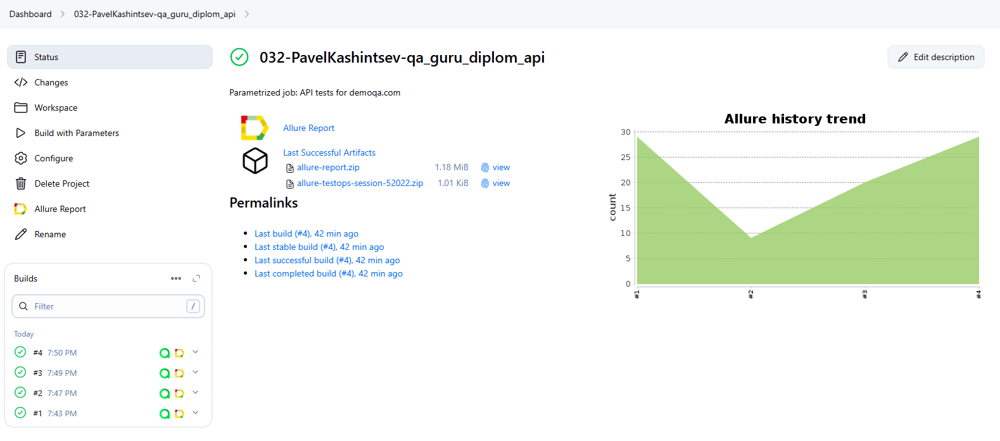
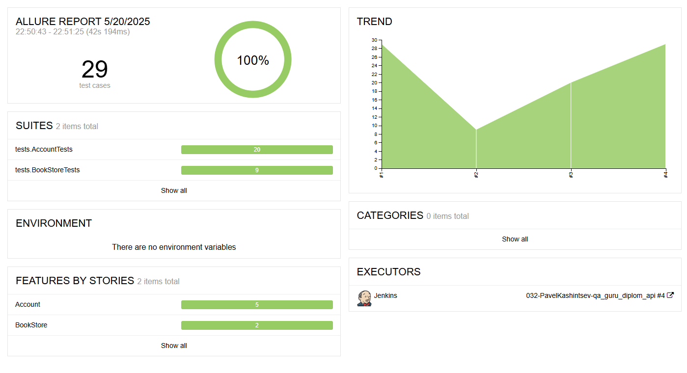
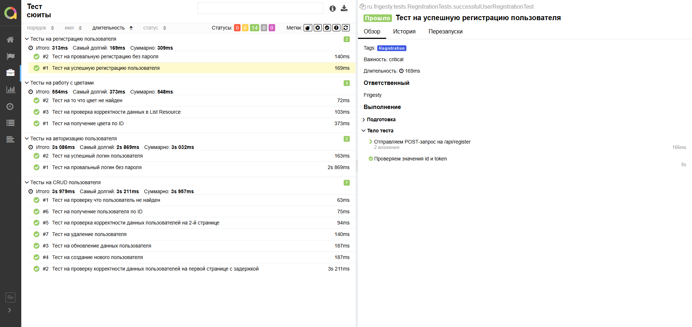
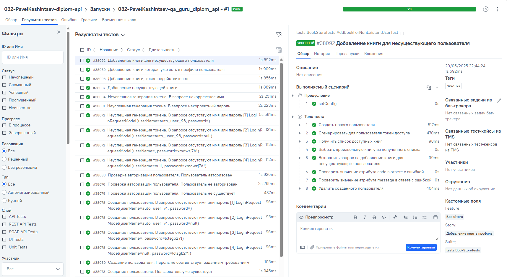
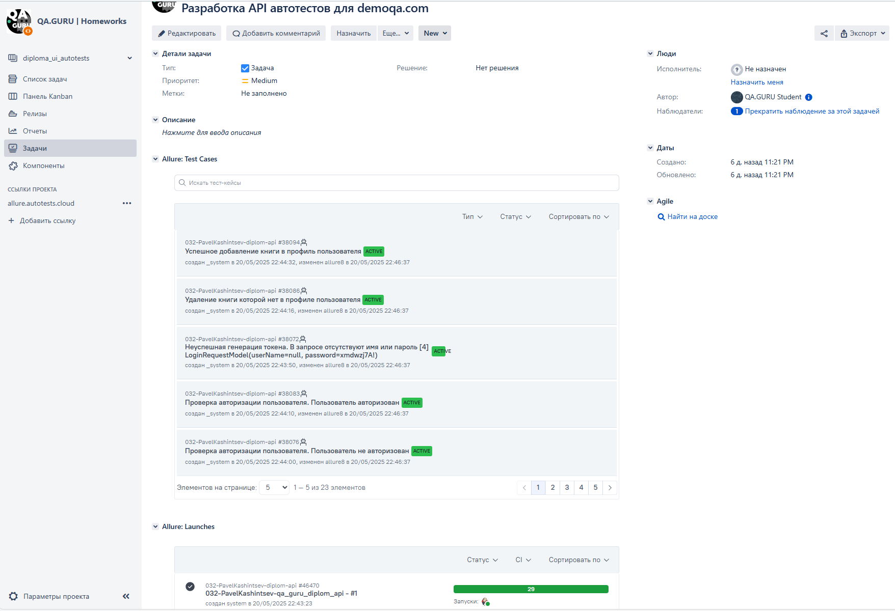
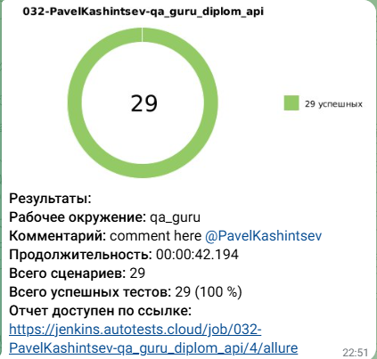

# Проект по автоматизации тестирования API для сайта [Demoqa.com](https://demoqa.com/)
<p align="center"><a href="https://demoqa.com/"></a></p>

> Demoqa.com - платформа для QA-инженеров предоставляющая публичный API для отработки навыков тестирования программного обеспечения

## **Содержание:**
____
* <a href="#tools">Технологии и инструменты</a>
* <a href="#cases">Примеры тест-кейсов</a>
* <a href="#localrun">Локальный запуск тестов</a>
* <a href="#remoterun">Запуск тестов в Jenkins</a>
* <a href="#report">Allure отчет</a>
* <a href="#testops">Интеграция с Allure TestOps</a>
* <a href="#jira">Интеграция с Jira</a>
* <a href="#telegram">Уведомления в Telegram</a>
____

<a id="tools"></a>
## Технологии и инструменты:
<div align="center">
<a href="https://www.jetbrains.com/idea/"></a>
<a href="https://github.com/"></a>  
<a href="https://www.java.com/"></a>
<a href="https://gradle.org/"></a>  
<a href="https://junit.org/junit5/"></a>
<a href="https://rest-assured.io/"></a>
<a href="https://www.jenkins.io/"></a>
<a href="https://github.com/allure-framework/"></a>
<a href="https://qameta.io/"></a>
<a href="https://www.atlassian.com/software/jira"></a>  
<a href="https://telegram.org/"></a>
</div>

____
<a id="cases"></a>
## Примеры тест-кейсов:
____
- ✓ *Успешное создание нового пользователя*
- ✓ *Неуспешное создание нового пользователя*
- ✓ *Успешная генерация токена для пользователя*
- ✓ *Неуспешная генерация токена для пользователя*
- ✓ *Авторизация пользователя*
- ✓ *Проверка авторизации пользователя*
- ✓ *Успешное удаление пользователя*
- ✓ *Неуспешное удаление пользователя*
- ✓ *Успешное добавление книги в профиль пользователя*
- ✓ *Неуспешное добавление книги в профиль пользователя*
- ✓ *Успешное удаление книги из профиля пользователя*
- ✓ *Неуспешное удаление книги из профиля пользователя*
- ✓ *Удаление всех книг из профиля пользователя*

____
<a id="localrun"></a>

## Локальный запуск тестов
___
***Локальный запуск всех тестов:***
```bash
gradle clean all
```
***Локальный запуск позитивных тестов:***
```bash
gradle clean positive
```
***Локальный запуск негативных тестов:***
```bash
gradle clean negative
```
___
<a id="remoterun"></a>

## Запуск тестов в [Jenkins](https://jenkins.autotests.cloud/job/032-PavelKashintsev-qa_guru_diplom_api/)
____
Для запуска тестов в Jenkins нужно нажать на кнопку Build with Parameters

<p align="center">

</p>


### **Параметры сборки в Jenkins:**

- **SCOPE**
  - *all* - запусков всех тестов
  - *positive* - запусков позитивных тестов
  - *negative* - запусков негативных тестов

____
<a id="report"></a>

## [Allure отчёт](https://jenkins.autotests.cloud/job/032-PavelKashintsev-qa_guru_diplom_api/allure/)
____
### Графики

<p align="center">

</p>

### Тесты

<p align="center">

</p>

<a id="testops"></a>
____
## Интеграция с [Allure TestOps](https://allure.autotests.cloud/project/4762/test-cases)
____
<p align="center">

</p>

<a id="jira"></a>
____
## Интеграция с [Jira](https://jira.autotests.cloud/browse/HOMEWORK-1452)
____
<p align="center">

</p>

<a id="telegram"></a>
____
## Уведомления в Telegram
____
По результатам каждого прогона тестов в Jenkins отправляется сообщение в Telegram. Сообщение содержит информацию о прогоне, а также диаграмму со статистикой прохождения тестов.

<p align="center">

</p>